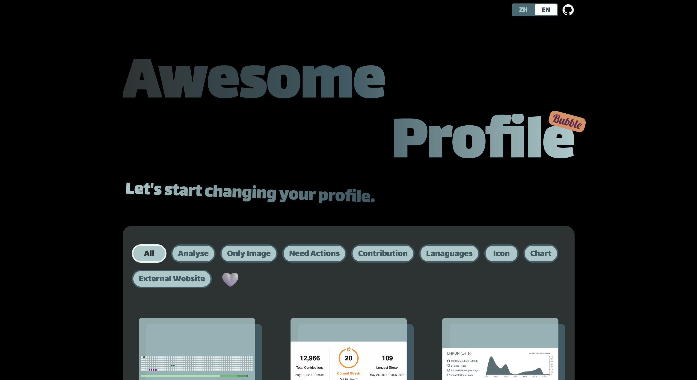

<h1 align="center">
  Bubble
  👻
</h1>

  让我们开始改变你的 Profile 吧！

**中文** | [English](./README.md)

  📜 目前，所有内容均由我手动收录，因此，如果有你觉得有趣而我没有收录的内容，欢迎提Issue。我会随时关注。

<h3
  style="background-image: linear-gradient(to right, #2C3333, #395B64, #A5C9CA);color: transparent;-webkit-background-clip: text;"
>
  已收录
</h3>

+ [Snk](https://github.com/Platane/snk)
+ [Github Readme Streak Stats](https://github.com/DenverCoder1/github-readme-streak-stats)
+ [GitHub Profile Summary Cards](https://github.com/vn7n24fzkq/github-profile-summary-cards)
+ [GitHub Readme Stats](https://github.com/anuraghazra/github-readme-stats)
+ [Shields](https://github.com/badges/shields)
+ [GitHub Profile Trophy](https://github.com/ryo-ma/github-profile-trophy)
+ [GitHub Profile 3D Contrib](https://github.com/yoshi389111/github-profile-3d-contrib)
+ [GitHub Profile Views Counter](https://github.com/antonkomarev/github-profile-views-counter)
+ [Github Contribution Stats](https://github.com/LordDashMe/github-contribution-stats)
+ [GitHub Readme StackOverflow](https://github.com/omidnikrah/github-readme-stackoverflow)
+ [README Jokes](https://github.com/ABSphreak/readme-jokes)
+ [LeetCode Readme Stats](https://github.com/KnlnKS/leetcode-stats)
+ [Star History](https://github.com/star-history/star-history)
+ [Github Readme Quotes](https://github.com/PiyushSuthar/github-readme-quotes)
+ [Todoist Stats](https://github.com/abhisheknaiidu/todoist-readme)
+ [GitHub Readme Medium](https://github.com/omidnikrah/github-readme-medium)
+ [Blog post workflow](https://github.com/gautamkrishnar/blog-post-workflow)
+ [SVG Banners](https://github.com/Akshay090/svg-banners)
+ [GitHub Widgetbox](https://github.com/Jurredr/github-widgetbox)
+ [contributors-img](https://github.com/lacolaco/contributors-img)
+ [Last.fm Recently Played README](https://github.com/JeffreyCA/lastfm-recently-played-readme)
+ [GitHub Stats Terminal Style](https://github.com/yogeshwaran01/github-stats-terminal-style)
+ [Wake Readme Stats](https://github.com/anmol098/waka-readme-stats)
+ [Mermaid](https://github.com/mermaid-js/mermaid)
+ [Techstack Generator](https://techstack-generator.vercel.app/)
+ [Readme Typing SVG](https://github.com/DenverCoder1/readme-typing-svg)
+ [Github Profile Header Generator](https://github.com/leviarista/github-profile-header-generator)
+ [PageSpeed Insights for README](https://github.com/ankurparihar/readme-pagespeed-insights)
+ [activity-box](https://github.com/JasonEtco/activity-box)
+ [GitHub Spray](https://github.com/Annihil/github-spray)
+ [Github Readme Activity Graph](https://github.com/Ashutosh00710/github-readme-activity-graph)
+ [GitHub Wrapped](https://github.com/neat-run/wrapped)
+ [Capsule Render](https://github.com/kyechan99/capsule-render)
+ [GitHub Readme YouTube Cards](https://github.com/DenverCoder1/github-readme-youtube-cards)
+ [Animated Fluent Emojis](https://animated-fluent-emoji.vercel.app/)

